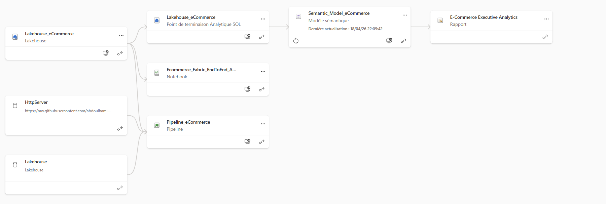

# 🚀 Ecommerce End-to-End Analytics Platform (Microsoft Fabric)

---

> 💡 **Production-ready analytics system — from raw GitHub data to executive insights**  
> ✨ *I design scalable data systems that transform raw data into business decisions.*

---

## 📊 Dashboard Preview

---

## 📈 Key Results

- 💰 **$677M Net Revenue analyzed**
- 📈 **+106% Revenue growth identified**
- 👥 **+63% Customer growth tracked**
- ⚠️ **Revenue concentration (~67% on top segments)**
- 🎯 **High-value customers drive majority of business value**

---

## 🚀 Business Impact

👉🏾 Enabled identification of key revenue growth drivers  
👉🏾 Highlighted customer concentration risk for strategic decision-making  
👉🏾 Delivered actionable segmentation insights  
👉🏾 Built a scalable analytics foundation for future growth  

---

## 🧠 Executive Summary

This project delivers a **complete end-to-end analytics platform** built on **Microsoft Fabric**, transforming raw CSV data from GitHub into **actionable business insights**.

👉🏾 Full data lifecycle:

GitHub CSV → Dynamic Pipeline → Lakehouse → Semantic Model → Dashboard

---

## ⚙️ Data Pipeline (Dynamic Ingestion)

---

## 🔗 Data Lineage (End-to-End)

👉🏾 This view represents the full end-to-end data flow:

GitHub → Pipeline → Lakehouse → Semantic Model → Power BI Report  

👉🏾 It provides visibility into:
- data lineage and traceability 
- interdependencies across components 
- the overall end-to-end architecture

---

## 🧱 Data Architecture (Medallion)

| Layer | Description |
|------|------------|
| Bronze | Raw ingestion from GitHub CSV |
| Silver | Cleaned & standardized data |
| Gold | Analytical model (facts & dimensions) |

---

## 🧰 Tech Stack

Microsoft Fabric  
PySpark  
Power BI  
DAX  
GitHub  

---

## 🏁 Conclusion

👉🏾 This project demonstrates a **real-world modern data platform**.

---

## ⭐ Final Thought

Data becomes valuable when it drives decisions.
